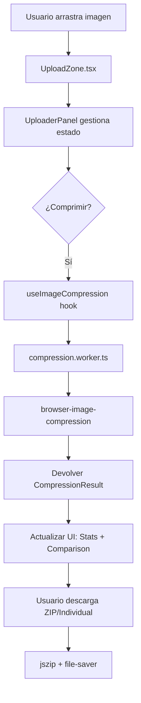

# Arquitectura del Proyecto - Pixel Crunch

> Nota de vigencia (abril 2026): este documento describe la arquitectura objetivo (target). El estado ejecutado por fases y entregables cerrados se mantiene en `docs/PHASES.md`.

## 📂 Estructura de Carpetas (Target)

```
src/
├── components/
│   ├── ui/                    # Componentes base reutilizables (Monokai Theme)
│   │   ├── Button.tsx
│   │   ├── Card.tsx
│   │   ├── Badge.tsx
│   │   └── Toaster.tsx        # Implementación con Sonner
│   ├── features/              # Componentes con lógica de negocio
│   │   ├── uploader/
│   │   │   ├── UploadZone.tsx        # Zona de Drag & Drop (react-dropzone)
│   │   │   ├── ImagePreview.tsx      # Carrusel/Grid de miniaturas
│   │   │   └── UploaderPanel.tsx     # Orquestador principal del flujo dual
│   │   ├── compressor/
│   │   │   ├── CompressionProgress.tsx
│   │   │   ├── CompressionStats.tsx
│   │   │   ├── ImageComparison.tsx   # Comparador Antes/Después
│   │   │   └── QualitySlider.tsx     # Control de calidad (H/V)
│   └── layout/                # Componentes de estructura Astro
│       ├── Header.astro
│       ├── Footer.astro
│       └── ThemeToggle.tsx
├── hooks/                     # Custom React Hooks
│   ├── useImageCompression.ts # Lógica de compresión multi-hilo
│   └── useTheme.ts            # Gestión de tema Dark/Light
├── lib/                       # Utilidades y lógica core
│   ├── formats.ts             # Definición de formatos soportados (MIME/Ext)
│   ├── toast.ts               # Wrapper para notificaciones
│   └── utils.ts               # clsx, tailwind-merge, formatBytes
├── types/                     # TypeScript Types/Interfaces
│   ├── upload.ts              # Props y estados de UI
│   └── compression.ts         # Resultados y mensajes del Worker
├── workers/                   # Web Workers
│   └── compression.worker.ts  # Procesamiento pesado fuera del hilo principal
├── layouts/
│   └── Layout.astro           # Layout base (Head, SEO, Fonts)
├── pages/
│   └── index.astro            # Página principal (Flujo Dual ES)
│   └── en/index.astro         # Página principal (Flujo Dual EN)
└── styles/
    └── global.css             # TailwindCSS v4 + Custom Monokai Theme
```

---

## 🔄 Flujo de Datos Principal



---

## 🎯 Decisiones Técnicas

### 1. ¿Por qué Astro Islands Architecture?
**Problema:** React SPA (Single Page App) carga todo el JS aunque no lo uses.  
**Solución:** Astro genera HTML estático y solo hidrata componentes interactivos.

**Ejemplo Real:**
```astro
---
// index.astro
import { UploaderPanel } from '../components/features/uploader';
---
<UploaderPanel client:load /> <!-- Solo esta isla carga React -->
```

**Resultado:**
- Header/Footer/Docs: 0 KB de JS.
- Interactividad concentrada en el Uploader.

---

### 2. ¿Por qué browser-image-compression?
- ✅ Manejo automático de EXIF (rotación).
- ✅ Soporte multi-formato (JPG, PNG, WebP).
- ✅ Web Workers integrado.

---

### 3. ¿Por qué Web Workers?
**Problema:** La compresión bloquea el hilo principal (UI congelada).  
**Solución:** `useImageCompression` delega a un Worker dedicado, manteniendo la barra de progreso fluida.

---

## 🧪 Estrategia de Testing (Vitest)

El proyecto cuenta con una suite de pruebas que cubre:
- **Hooks:** `useImageCompression.test.ts`, `useTheme.test.ts`.
- **Componentes:** `Button.test.tsx`, `CompressionProgress.test.tsx`.
- **Utils:** `formats.test.ts`, `utils.test.ts`.

Validación automática vía **GitHub Actions** en cada Pull Request.
