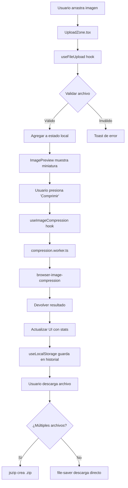

# Arquitectura del Proyecto - Pixel Crunch

## 📂 Estructura de Carpetas (Target)

```
src/
├── components/
│   ├── ui/                    # Componentes base reutilizables
│   │   ├── Button.tsx
│   │   ├── Card.tsx
│   │   ├── Badge.tsx
│   │   └── Toast.tsx
│   ├── features/              # Componentes con lógica de negocio
│   │   ├── uploader/
│   │   │   ├── UploadZone.tsx        # Zona de Drag & Drop
│   │   │   ├── ImagePreview.tsx      # Miniaturas + Preview
│   │   │   └── FileList.tsx          # Lista de archivos cargados
│   │   ├── compressor/
│   │   │   ├── CompressorEngine.tsx  # Orquestador principal
│   │   │   ├── CompressionProgress.tsx
│   │   │   ├── CompressionStats.tsx
│   │   │   └── QualitySlider.tsx
│   │   └── history/
│   │       ├── HistoryPanel.tsx
│   │       └── HistoryItem.tsx
│   └── layout/                # Componentes de estructura
│       ├── Header.astro
│       ├── Footer.astro
│       └── ThemeToggle.tsx
├── hooks/                     # Custom React Hooks
│   ├── useImageCompression.ts # Hook principal de compresión
│   ├── useLocalStorage.ts     # Persistencia en localStorage
│   ├── useTheme.ts            # Tema oscuro/claro
│   └── useFileUpload.ts       # Wrapper de react-dropzone
├── lib/                       # Utilidades y lógica core
│   ├── compression.ts         # Wrapper de browser-image-compression
│   ├── download.ts            # Funciones de descarga (ZIP, individual)
│   ├── utils.ts               # clsx, tailwind-merge, formatters
│   └── constants.ts           # Constantes globales (formatos, límites)
├── types/                     # TypeScript Types/Interfaces
│   ├── index.ts               # Exports principales
│   ├── image.ts               # ImageFile, CompressionResult, etc.
│   └── history.ts             # HistoryEntry
├── workers/                   # Web Workers
│   └── compression.worker.ts  # Worker para procesamiento pesado
├── layouts/
│   └── Layout.astro           # Layout base de la app
├── pages/
│   └── index.astro            # Página principal
└── styles/
    └── global.css             # Estilos globales + TailwindCSS
```

---

## 🔄 Flujo de Datos Principal



---

## 🎯 Decisiones Técnicas

### 1. ¿Por qué Astro Islands Architecture?
**Problema:** React SPA (Single Page App) carga todo el JS aunque no lo uses.  
**Solución:** Astro genera HTML estático y solo hidrata componentes interactivos.

**Ejemplo:**
```astro
---
// Layout.astro - HTML estático
import Header from '../components/layout/Header.astro';
import CompressorEngine from '../components/features/compressor/CompressorEngine.tsx';
---

<Header />  <!-- HTML puro, 0 JS -->
<CompressorEngine client:load />  <!-- React, se hidrata solo este componente -->
```

**Resultado:**
- Layout/Header/Footer: 0 KB de JS
- Solo la zona interactiva (uploader) carga React

---

### 2. ¿Por qué browser-image-compression?
**Alternativas evaluadas:**
- **Canvas API nativo:** Complejo, sin manejo de EXIF.
- **@jsquash/avif:** WASM puro, excelente para AVIF pero overkill para V1.
- **Compressor.js:** No tiene mantenimiento activo.

**Ganador:** `browser-image-compression`
- ✅ Manejo automático de EXIF (rotación de imágenes)
- ✅ Soporte multi-formato (JPG, PNG, WebP)
- ✅ API simple y bien documentada
- ✅ Web Workers integrado (no bloquea UI)

**Ejemplo de uso:**
```typescript
import imageCompression from 'browser-image-compression';

const options = {
  maxSizeMB: 1,
  maxWidthOrHeight: 1920,
  useWebWorker: true,
};

const compressedFile = await imageCompression(file, options);
```

---

### 3. ¿Por qué localStorage para historial?
**Alternativas:**
- **IndexedDB:** Más potente, pero complejo para nuestro caso.
- **SessionStorage:** Se pierde al cerrar tab.
- **Backend:** Va contra nuestra filosofía (privacidad).

**Decisión:** localStorage con límite de 5 items
- ✅ API síncrona simple
- ✅ Persistente entre sesiones
- ✅ Suficiente para metadatos (nombre, fecha, % ahorrado)
- ⚠️ Límite de ~5MB por dominio (OK, solo guardamos metadata, no imágenes)

**Estructura de datos:**
```typescript
interface HistoryEntry {
  id: string;
  filename: string;
  originalSize: number;
  compressedSize: number;
  format: 'jpg' | 'png' | 'webp';
  timestamp: number;
}

// En localStorage:
// key: 'pixel-crunch-history'
// value: JSON.stringify(HistoryEntry[])
```

---

### 4. ¿Por qué Web Workers?
**Problema:** La compresión de imágenes bloquea el hilo principal (UI se congela).  
**Solución:** Mover la lógica pesada a un Web Worker.

**Implementación:**
```typescript
// workers/compression.worker.ts
import imageCompression from 'browser-image-compression';

self.onmessage = async (e) => {
  const { file, options } = e.data;
  const compressed = await imageCompression(file, options);
  self.postMessage({ success: true, file: compressed });
};
```

**Resultado:**
- UI permanece fluida
- Barra de progreso actualiza en tiempo real
- Usuario puede cancelar operación

---

## 🏗️ Patrones de Diseño Aplicados

### 1. Custom Hooks para Lógica Reutilizable
```typescript
// hooks/useImageCompression.ts
export function useImageCompression() {
  const [isCompressing, setIsCompressing] = useState(false);
  const [progress, setProgress] = useState(0);

  const compress = async (file: File) => {
    setIsCompressing(true);
    // ... lógica de compresión
    setIsCompressing(false);
  };

  return { compress, isCompressing, progress };
}
```

### 2. Compound Components para Flexibilidad
```tsx
// Uso:
<Compressor>
  <Compressor.UploadZone />
  <Compressor.Preview />
  <Compressor.Stats />
</Compressor>
```

### 3. Render Props para Compartir Estado
```tsx
<FileUploader>
  {({ files, uploadFile }) => (
    <>
      <DropZone onDrop={uploadFile} />
      <FileList files={files} />
    </>
  )}
</FileUploader>
```

---

## 🔐 Consideraciones de Seguridad

### 1. Validación de Archivos
```typescript
const ALLOWED_TYPES = ['image/jpeg', 'image/png', 'image/webp'];
const MAX_FILE_SIZE = 50 * 1024 * 1024; // 50MB

function validateFile(file: File): boolean {
  if (!ALLOWED_TYPES.includes(file.type)) return false;
  if (file.size > MAX_FILE_SIZE) return false;
  return true;
}
```

### 2. Sanitización de Nombres de Archivo
```typescript
function sanitizeFilename(name: string): string {
  return name
    .replace(/[^a-z0-9_\-\.]/gi, '_') // Eliminar caracteres peligrosos
    .substring(0, 255); // Límite de longitud
}
```

### 3. Content Security Policy (CSP)
```html
<!-- En Layout.astro -->
<meta http-equiv="Content-Security-Policy" 
      content="default-src 'self'; worker-src 'self' blob:;">
```

---

## 📊 Gestión de Estado

### Opción Elegida: React Context + Hooks
**¿Por qué no Redux/Zustand?**
- Scope pequeño (solo 1 página)
- No necesitamos time-travel debugging
- Context API es suficiente

**Estructura:**
```typescript
// context/AppContext.tsx
interface AppState {
  files: File[];
  compressedResults: Map<string, Blob>;
  history: HistoryEntry[];
}

const AppContext = createContext<AppState | null>(null);
```

---

## 🚀 Estrategia de PWA

### Service Worker con Vite PWA
```typescript
// vite.config.ts
export default {
  plugins: [
    VitePWA({
      strategies: 'injectManifest', // Control total
      srcDir: 'src',
      filename: 'sw.ts',
      manifest: {
        name: 'Pixel Crunch',
        short_name: 'PixelCrunch',
        theme_color: '#0f172a',
        icons: [
          { src: '/icon-192.png', sizes: '192x192', type: 'image/png' },
          { src: '/icon-512.png', sizes: '512x512', type: 'image/png' },
        ],
      },
    }),
  ],
};
```

### Estrategia de Caché
- **HTML/JS/CSS:** NetworkFirst (siempre intenta red, fallback a caché)
- **Imágenes estáticas:** CacheFirst (de la app, no del usuario)
- **Fonts:** CacheFirst con expiración de 30 días

---

## 🧪 Testing Strategy (Futuro - Fase 5)

> **Nota:** En el MVP (Fases 1-4) no implementaremos tests. Esta sección es referencia para el futuro.

### Unit Tests (Vitest)
- Hooks: `useImageCompression`, `useLocalStorage`
- Utils: `compression.ts`, `download.ts`

### Component Tests (Testing Library)
- `UploadZone`: Drag & Drop funciona
- `CompressionStats`: Muestra datos correctos

### E2E (Playwright - Opcional)
- Flujo completo: Upload → Compress → Download

---

## 📦 Bundle Optimization

### Code Splitting Automático
Astro + Vite automáticamente separan:
- Vendor chunks (React, librerías)
- Page chunks (solo index.astro por ahora)
- Component chunks (islands)

### Tree Shaking
```typescript
// ❌ Malo: Importa toda la librería
import _ from 'lodash';

// ✅ Bueno: Solo importa la función necesaria
import { clsx } from 'clsx';
```

### Lazy Loading de Componentes Pesados
```typescript
const HistoryPanel = lazy(() => import('./features/history/HistoryPanel'));

// Uso:
<Suspense fallback={<div>Cargando historial...</div>}>
  <HistoryPanel />
</Suspense>
```

---

## 🎨 Sistema de Diseño (Tokens)

### Colores (TailwindCSS v4)
```css
/* global.css */
@theme {
  --color-primary: oklch(0.5 0.2 250); /* Azul */
  --color-success: oklch(0.6 0.15 145); /* Verde */
  --color-error: oklch(0.55 0.22 25); /* Rojo */
}
```

### Espaciado Consistente
- Padding: 4, 8, 16, 24, 32px (múltiplos de 4)
- Border Radius: 4px (small), 8px (medium), 12px (large)

---

## 📝 Notas para Futuros Desarrolladores

1. **No uses `any` en TypeScript.** Si no sabes el tipo, usa `unknown` y valida.
2. **Comenta lógica compleja**, especialmente en `compression.ts`.
3. **No guardes imágenes en localStorage**, solo metadata.
4. **Testea en Safari/Firefox**, no solo Chrome.
5. **Usa `console.error` para errores reales**, no `console.log`.
